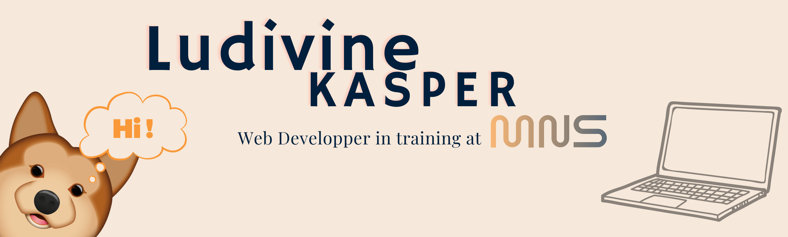

### Hi there 👋🏻, this is Ludivine's GitHub !
#### Currently in training to become a Web Developper 💻
Looking for a remote internship of two months for summer 2023 to validate my degree. Checkout my CV ⬇️

Skills: HTML / CSS / JavaScript / React / PHP

🔭 I’m currently working on my portfolio website 👩🏼‍💻

📨 How to reach me: Add me on [Linkedin](https://www.linkedin.com/in/ludivine-kasper-laas-87729b253/)

🤎 Loving mother for my Akita Inu puppy 🐕

